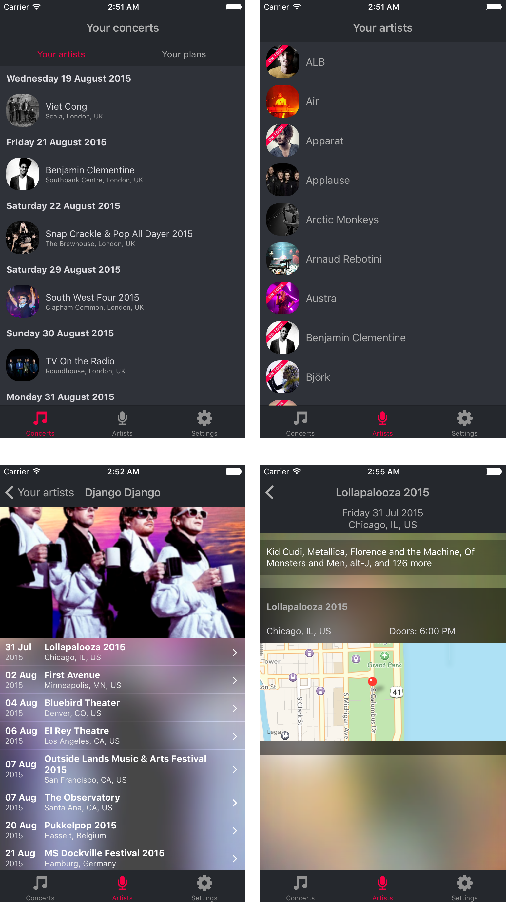

# sk-react-native

An experimentation to see how cool is React Native:

* Bring continuous deployment to iOS 😍
* Build native app without any Objective-C / swift knowledge
* Enjoy a super-fast dev workflow

# Resources

* [Slick official tutorial](https://facebook.github.io/react-native/docs/getting-started.html)
* [Project using an Amazon S3 bucket to host js bundle](https://github.com/JoeStanton/london-react/)
* [Continuous deployment to S3 using CircleCI](http://benlopatin.com/deploying-static-sites-circle-ci/)
* [React Parts components library](https://react.parts/native-ios)
* [How to render ListView with section headers](http://moduscreate.com/react-native-listview-with-section-headers/)
* [Smart and dumb components](https://medium.com/@dan_abramov/smart-and-dumb-components-7ca2f9a7c7d0) by [@dan_abramov](https://twitter.com/@dan_abramov)
* [Ready to use jsfiddle React playground](http://jsfiddle.net/reactjs/69z2wepo/)
* [Defining dev/prod target builds in XCode](http://stackoverflow.com/a/10498308/1265207)

# Screenshots!

_Note: results after ~a week~ as a side project. Probably not up to date._

# Notes

## Project setup

It took us 2h30 to have the complete target setup:

1. Create the React Native app
2. Create and configure access rights of the Amazon S3 buckets (while being complete Amazon noobs)
3. Setup CircleCI for continuous deployment to S3
4. Make the app download the javascript bundle from S3

### Basic React Native

It literally takes 2 minutes to create and run a React Native app, including Live Reload and Chrome Dev Tools debugging. The project set experience could not be better.

### Continuous Deployment

As React Native can download the javascript bundle from anywhere, not just locally, continuous deployment is as simple uploading a file and make it available on internet.

#### Amazon S3 setup

You need to create a bucket, a specific continuous deployment user and set the proper permission policy on this bucket. See [the sample policy `./s3-bucket-policy.json`](./s3-bucket-policy.json).

#### Circle CI

You can define all your continuous deployment setup in a `circle.yml` file, defining the build, test and deploy steps. We copied and adjusted it from the [london-react app](https://github.com/JoeStanton/london-react/)

The only two things you need to from the CircleCI website is :

* Add the project (duh)
* Copy the Amazon S3 newly created user credentials in the `AWS Permissions` project settings view.
* `git push origin master`
* Sip some margarita

### Mother effing splash and icons images

Who would have imagined how painful this could be?

Headache-less way of doing it:

1. Create a 1000x1000px icon ; logo should be ~750px
1. Create a 2048x2048px splash screen ; logo should be ~1000px, centered
1. Install [this app](https://itunes.apple.com/gb/app/asset-catalog-creator-free/id866571115?mt=12)
1. Pay £1.49 for the splash screen export, best £1.49 spent ever
1. Follow the instructions, this is easy

## Troubleshooting

### Project local setup

**fail to build** `'RCTRootView.h' file not found`, should happen by default (meh).

1. You didn't forget to run `npm install`, did you?
1. Click on the root project item
1. Build settings
1. Type `Search path` in the search box
1. Switch `Always Search User Paths` to `Yes`
1. Restart XCode
1. Profit

### I changed some js code but it doesn't show on built app?!

By default, this project is setup to run local code in simulator and S3 hosted code on a regular iPhone.

If you want to change that, go to the project settings in XCode, search for `macros` and make it `DEBUG` is define for your target platform to run local code, or undefined to run
S3 hosted.

# Credits

* @vjo [twitter](https://twitter.com/vjo) [github](https://github.com/vjo) from Twitter
* @ArnaudRinquin [twitter](https://twitter.com/ArnaudRinquin) [github](https://github.com/ArnaudRinquin) from Songkick
